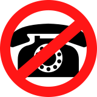

# PhoneBlock
Der Spam-Filter für dein Telefon - keine Kosten, keine Zusatzhardware

* [PhoneBlock-Homepage](https://phoneblock.net/)
* [Installation SPAM-Anrufbeantworter in der Fritz!Box](https://phoneblock.net/phoneblock/anrufbeantworter/)
* [Installation Blocklist-Telefonbuch in der Fritz!Box](https://phoneblock.net/phoneblock/setup.jsp)
* [Installation PhoneBlock auf Android-Telefonen](https://phoneblock.net/phoneblock/setup-android/)
* [Installation PhoneBlock auf iPhones](https://phoneblock.net/phoneblock/setup-iphone/)
* [Berichte über aktuelle Werbeanrufer](https://phoneblock.net/phoneblock/status.jsp)
* [Fragen und Antworten zu PhoneBlock](https://phoneblock.net/phoneblock/faq.jsp)
* [API für Entwickler](https://phoneblock.net/phoneblock/api/)

## Wie funktioniert PhoneBlock?

PhoneBlock ist ein zentrales Adressbuch mit von der PhoneBlock-Community gepflegten Telefonnummern von Spam-Anrufern. Dieses Adressbuch kann entweder in deinem Internet-Router "FRITZ!Box" als Sperrliste eingerichtet werden, steuert den PhoneBlock-Anrufbeantworter, oder kann mit Hilfe einer App aud Deinem Mobiltelefon unerwünschte Anrufe unterdrücken oder markieren. Sobald eine Nummer zu der Sperrliste hinzugefügt wird, weist entweder deine FRITZ!Box Anrufer mit dieser Nummer automatisch ab, oder der PhoneBlock-Anrufbeantworter geht ran. Das Telefon bleibt stumm.

Solltest du trotzdem einen unerwünschten Anruf erhalten, weil die Nummer noch nicht in der Sperrliste ist, kannst du die Nummer ganz einfach in das PhoneBlock-Adressbuch deiner FRITZ!Box aufnehmen. Sobald du dies getan hast, aktualisiert deine FrizBox die Sperrliste und Anrufe von dieser neuen Nummer werden bei allen anderen Mitgliedern der PhoneBlock-Community sofort abgewiesen.

## Was sind die Voraussetzungen?

PhoneBlock kann sowohl für einen "Festnetzanschluss" als auch auf dem Mobiltelefon verwendet werden. Bei der Installation fürs Festnetz kann entweder die Blockliste in den Internet-Router importiert werden (hierfür wird einen "FRITZ!Box" mit FRITZ!OS 07.29 oder neuer von AVM benötigt), oder es kann der FritzBox-Anrufbeantworter an dem Internet-Router angemeldet werden, der immer bei SPAM-Anrufen rangeht. 

Beim Import der Blockliste direkt in den Router kann nur ein Teil der Blockliste verwendet werden, da es eine Größenbeschränkung für Telefonbücher in der FRITZ!Box gibt. Besser ist der FritzBox-Anrufbeantworter, weil dieser die gesamte Blockliste verwenden kann.

Das Einzige, was du noch brauchst, ist ein PhoneBlock-Konto, mit dem du die Telefonsperrliste in deiner FRITZ!Box einrichten kannst.

## Bist du bereit, loszulegen?

Nutze PhoneBlock live unter: https://phoneblock.net/ - keine Kosten, keine Zusatzhardware notwendig.

Du möchtest den Anrufbeantworter lieber bei Dir zu Hause betreiben - kein Problem versucht's doch am besten mit dem Docker-Image: https://hub.docker.com/r/phoneblock/answerbot

# English Version
The Spam-Filter for your Fritz!Box

## How does PhoneBlock work?
PhoneBlock is a central address book with telephone numbers of spam callers maintained by the PhoneBlock community. This address book can either be set up in your Internet router “FRITZ!Box” as a blacklist, controls the PhoneBlock answering machine, or can suppress or mark unwanted calls with the help of an app on your cell phone. As soon as a number is added to the blacklist, either your FRITZ!Box automatically rejects callers with this number or the PhoneBlock answering machine picks up. The phone remains silent.

If you still receive an unwanted call because the number is not yet on the blacklist, you can simply add the number to the PhoneBlock address book of your FRITZ! As soon as you have done this, your FrizBox will update the blacklist and calls from this new number will be immediately rejected by all other members of the PhoneBlock community.

## What are the requirements?
PhoneBlock can be used both for a landline and on a cell phone. When installing for the fixed network, either the blocklist can be imported into the Internet router (this requires a “FRITZ!Box” with FRITZ!OS 07.29 or newer from AVM), or the FritzBox answering machine can be registered on the Internet router, which always answers SPAM calls.

When importing the block list directly into the router, only part of the block list can be used, as there is a size limit for phone books in the FRITZ! The FritzBox answering machine is better because it can use the entire block list.

The only other thing you need is a PhoneBlock account with which you can set up the phone block list in your FRITZ!Box.

## Ready to get started?

Start using PhoneBlock live at: https://phoneblock.net/ - no cost, no additional hardware required.

You would prefer to operate the answering machine at home - no problem, just try the Docker image: https://hub.docker.com/r/phoneblock/answerbot
